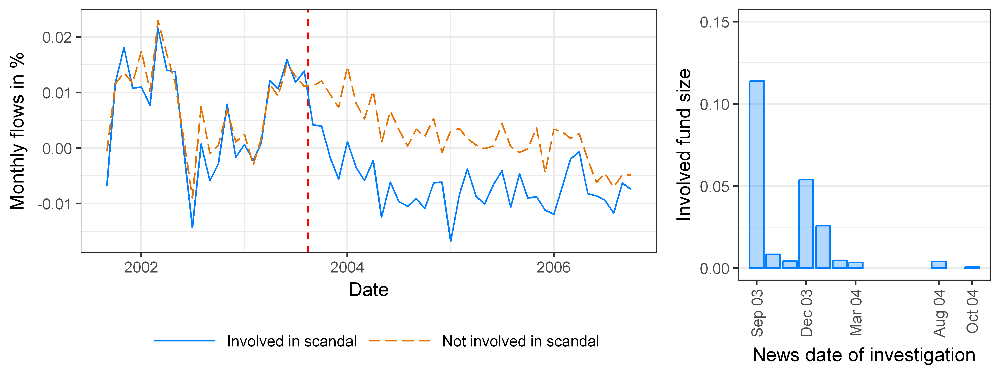

# Evidence From the 2003 Mutual Fund Scandal {#sec:scandal}

In September 2003, the New York Attorney General's office launched investigations into several high-profile mutual fund families for illegal trading practices. Families were charged with allowing favored clients to trade fund shares at stale prices at the expense of ordinary shareholders [@hw05; @zitzewitz06]. By the end of October 2004, official investigations had been announced against a total of twenty-five mutual fund families. 

@hw05 and @mccabe08 argue that investors penalized tainted funds with large outflows. This is borne out in my data. Figure \@ref(fig:scandalFlows) plots mean net flows by scandal involvement.^[
I follow Table 1 of @hw05 for classifying fund families embroiled in the scandal. The following is the list of fund families tainted by the scandal by month of the news date of investigation.
	September 2003: Alliance Bernstein, Franklin Templeton, Gabelli, Janus, Nations, One Group, Putnam, Strong.
	October 2003: Alger, Federated.
	November 2003: Excelsior/US Trust, Fremont, Loomis Sayles, PBHG.
	December 2003: AIM/Invesco, MFS, Heartland.
	January 2004: Columbia, Scudder, Seligman.
	February 2004: PIMCO.
	March 2004: ING, RS.
	August 2004: Evergreen. 
	October 2004: Sentinel.    
I identify funds belonging to these families as of August 2003 in my sample based on the share class names in the CRSP mutual fund dataset. I classify 289 of the 1,462 funds in my sample in August 2003 with existing holdings and gross returns as members of future tainted families.
Table~\ref{tab:snapShot200308} presents a snapshot of summary statistics as of August 2003 by future scandal involvement. Scandal funds are slightly older, larger, and have higher turnover to portfolio liquidity and expense ratios.]

(\#fig:scandalFlows)Net flows and relative size of funds involved in the scandal. I categorize funds according to Table 1 in @hw05. The left panel plots mean monthly net flows, defined according to @st98, by scandal involvement. The vertical line corresponds to August 2003, the month before the announcement of the first investigations. The right panel shows the total net assets of funds coming under investigation in a given month, relative to the total size of funds in my sample.

The two series track each other closely in the two years prior to the scandal, and diverge abruptly in September 2003. The wedge between the two groups persists until the end of 2006, coincident with the final settlements negotiated with the Securities and Exchange Commission [@zitzewitz09].^[The difference is statistically significant. I estimate a regression using a two year pre- and post-scandal window of observations of the form
$$
flow_{i,t}=\alpha_i + \alpha_t + \gamma Post_{i,t} +\varepsilon_{i,t},
$$
where $Post_{i,t}$ is an indicator for post news date for scandal funds. I find $\gamma=-9.16$\% per year, with t-statistic of $4.6$.] 

I conclude that the scandal caused a significant reallocation of resources away from tainted funds. Unless flows are perfectly offsetting, this shift will cause a relative reduction in the competitor size of the most similar funds. Under decreasing returns to competitor scale, we would expect the investment opportunities of these funds to improve in relative terms, leading them to differentially expand active management and earn higher returns. 

I test these hypotheses by comparing untainted funds with differential pre-scandal similarity to prospective scandal funds. I discard tainted funds as the internal upheaval following the scandal likely had a direct impact on their performance and investment behavior.^[In the aftermath of the investigations, several executives stepped down, and a number of portfolio managers were fired. Perhaps the highest profile casualty of the scandal was Richard S. Strong, founder of Strong Capital Management, who resigned in December 2003. Strong would go on to pay \$60 million in settlements and be barred from the industry. Strong Capital itself was acquired by Wells Fargo in 2004.] I take two approaches. The first is a straightforward difference-in-differences-style comparison of fund outcomes before and after the scandal as a function of their pre-scandal exposure to tainted funds. The second approach links fund outcomes directly to variation in competitor size attributable to abnormal flows among tainted funds. I first present the analysis on fund capital allocation, followed up by the analysis of fund performance.

## Before and After Analysis {#sec:scandalID}

I relate fund-by-fund differences in pre-scandal $[2003m8-W$, $2003m8]$ and post-scandal $[2004m11$, $2004m11+W] $ outcomes to pre-scandal exposure to competition from tainted funds. I consider $W\in\{1,2\}$ year windows. For a fund to be included in the estimation sample, it must have available holdings information for August 2003, and I must observe it both in the pre- and the post-scandal period.

I measure pre-scandal exposure as the proportion of competitor size attributable to prospective tainted funds as of August 2003. Let $\Phi$ denote the set of funds that belong to families later investigated, and define
\begin{equation}
ScandalExposure_i = \frac{\sum_{j\in \Phi} \psi_{i,j,2003m8} FundSize_{j,2003m8}}{\sum_{j\neq i}\psi_{i,j,2003m8} FundSize_{j,2003m8}}.
\end{equation}
On average, $22$\% of untainted funds' competitor size is due to tainted fund families. Exposure ranges from 7\% to over 40\%, with upper quartile 25\% and lower quartile 19\%.

To present interpretable summary statistics, I sort funds into high and low exposure groups depending on whether their $ScandalExposure$ is above or below the cross-sectional median. Table~\ref{tab:snapShotHL200308} gives a snapshot taken in August 2003. High exposure funds are slightly smaller, have higher turnover to portfolio liquidity ratios, expense ratios, $CompetitorSize$, and worse performance. Fund age is almost identical across the two groups, limiting the plausibility of life cycle effects as an explanation for differences in outcome paths. 

Figure \@ref(fig:exposureDID) summarizes the identifying variation in the data. I plot the groupwise cross-sectional mean of within-fund deviations for competitor size, log active share, and log turnover to portfolio liquidity ratio. The differential impact of the scandal across groups is identified by the difference in the pre- and post-scandal period wedges between the series. The $CompetitorSize$ of the low exposure group overall trends upward, despite a small dip in the middle of the scandal period. The $CompetitorSize$ of high exposure funds drops more substantively  during the scandal, and remains flat for almost a year after the end of the scandal period. The historical accident of scandal-related outflows at involved funds appear to have insulated their closest competitors from contemporaneous increases in the aggregate size of the industry. 

(\#fig:exposureDID)Untainted fund outcomes by exposure to competition from scandal funds. Funds are sorted into high and low exposure groups depending on whether their $ScandalExposure$ is above or below the cross-sectional median. The $\ln(CompetitorSize)$, $\ln(AS)$, and $\ln(TL^{-1/2})$ panels plot cross-sectional means of the variables' deviations from their respective within fund means across exposure groups. The $R^{FF3}$ panel plots the difference between the cross-sectional means of the within fund deviations of three factor adjusted gross returns across the two groups. Vertical lines correspond to August 2003, the month before the announcement of the first investigations, and October 2004, the month of the last investigations according to Table 1 of @hw05.

The turnover to portfolio liquidity ratio of the low exposure group exhibits a steady decline until late 2005, despite a momentary increase during the scandal. The high exposure group shows parallel trends until the beginning of the scandal period. Consistent with improved investment opportunities during the scandal, high exposure funds substantially decreased portfolio liquidity and increased turnover during 2004. The gap in within-fund turnover to portfolio liquidity ratios only begins to close at the end of 2006 as abnormal flows at scandal funds vanish. Active share of low exposure funds is essentially flat during this period, whereas active share of high exposure funds show steady increases during and after the scandal.

Given the volatility of returns, for easier comparison of fund performance I plot the difference between high and low exposure group cross-sectional means of within-fund three factor adjusted returns. High exposure funds relatively underperform low exposure funds in the pre-scandal period, are essentially even during the scandal, and enjoy a string of relative outperformance in the year after the end of the scandal period. The differential relative before and after performance of the two groups is consistent with decreasing returns to competitor scale.

To formally test for differential differences in before and after outcomes as a function of ex ante exposure to competition from prospective scandal funds, I perform regressions of the form
\begin{equation}
y_{i,t} = \alpha_i + \alpha_t + \gamma \left( \mathbb{I}_t \times ScandalExposure_i \right) + \mathbf{X}_{i,t}\Gamma + \varepsilon_{i,t},
(\#eq:didReg)
\end{equation}
where $\mathbf{X}_{i,t}$ includes log fund size and expense ratio, as dictated by theory. In the regression, exposure is a continuous variable.\footnote{
Unreported binned scatter plots suggest reasonably linear relations between $ScandalExposure$ and outcome variables after residualizing by fund and time fixed effects.
} 
I double cluster standard errors by fund and portfolio group $\times$ time. I normalize $ScandalExposure$ by its interquartile range ($\approx 6$\%).

<table class="table table-striped table-hover" style="font-size: 11px; margin-left: auto; margin-right: auto;">
<caption style="font-size: initial !important;">(\#tab:scandalSpillover)Capital Allocation and the Scandal: Before and After Analysis</caption>
 <thead>
  <tr>
   <th style="text-align:left;"> Dep. Var.: </th>
   <th style="text-align:center;"> $\ln(C.S.)$ </th>
   <th style="text-align:center;"> $\ln(AS)$ </th>
   <th style="text-align:center;"> $\ln(TL^{-1/2})$ </th>
   <th style="text-align:center;"> $\ln(L)$ </th>
   <th style="text-align:center;"> $\ln(S)$ </th>
   <th style="text-align:center;"> $\ln(D)$ </th>
   <th style="text-align:center;"> $\ln(C)$ </th>
   <th style="text-align:left;"> $\ln(B)$ </th>
  </tr>
 </thead>
<tbody>
  <tr grouplength="22"><td colspan="9" style="text-align: center;"><strong>1 year window</strong></td></tr>
<tr>
   <td style="text-align:left; padding-left: 2em;" indentlevel="1"> $\mathbb{I}\times ScanEx$ </td>
   <td style="text-align:center;"> -0.034* </td>
   <td style="text-align:center;"> 0.029*** </td>
   <td style="text-align:center;"> 0.010 </td>
   <td style="text-align:center;"> -0.100*** </td>
   <td style="text-align:center;"> -0.105*** </td>
   <td style="text-align:center;"> -0.039* </td>
   <td style="text-align:center;"> -0.032** </td>
   <td style="text-align:left;"> -0.011 </td>
  </tr>
  <tr>
   <td style="text-align:left; padding-left: 2em;" indentlevel="1">  </td>
   <td style="text-align:center;"> (0.020) </td>
   <td style="text-align:center;"> (0.006) </td>
   <td style="text-align:center;"> (0.031) </td>
   <td style="text-align:center;"> (0.025) </td>
   <td style="text-align:center;"> (0.019) </td>
   <td style="text-align:center;"> (0.022) </td>
   <td style="text-align:center;"> (0.015) </td>
   <td style="text-align:left;"> (0.016) </td>
  </tr>
  <tr>
   <td style="text-align:left; padding-left: 2em;" indentlevel="1"> $\ln(FundSize)$ </td>
   <td style="text-align:center;"> 0.149*** </td>
   <td style="text-align:center;"> -0.018*** </td>
   <td style="text-align:center;"> -0.205*** </td>
   <td style="text-align:center;"> 0.184*** </td>
   <td style="text-align:center;"> 0.088*** </td>
   <td style="text-align:center;"> 0.148*** </td>
   <td style="text-align:center;"> 0.074*** </td>
   <td style="text-align:left;"> 0.084*** </td>
  </tr>
  <tr>
   <td style="text-align:left; padding-left: 2em;" indentlevel="1">  </td>
   <td style="text-align:center;"> (0.017) </td>
   <td style="text-align:center;"> (0.006) </td>
   <td style="text-align:center;"> (0.025) </td>
   <td style="text-align:center;"> (0.022) </td>
   <td style="text-align:center;"> (0.013) </td>
   <td style="text-align:center;"> (0.021) </td>
   <td style="text-align:center;"> (0.016) </td>
   <td style="text-align:left;"> (0.015) </td>
  </tr>
  <tr>
   <td style="text-align:left; padding-left: 2em;" indentlevel="1"> $\ln(f)$ </td>
   <td style="text-align:center;"> -0.097 </td>
   <td style="text-align:center;"> 0.004 </td>
   <td style="text-align:center;"> 0.113 </td>
   <td style="text-align:center;"> -0.073 </td>
   <td style="text-align:center;"> -0.169** </td>
   <td style="text-align:center;"> 0.040 </td>
   <td style="text-align:center;"> 0.105 </td>
   <td style="text-align:left;"> -0.061 </td>
  </tr>
  <tr>
   <td style="text-align:left; padding-left: 2em;" indentlevel="1">  </td>
   <td style="text-align:center;"> (0.073) </td>
   <td style="text-align:center;"> (0.027) </td>
   <td style="text-align:center;"> (0.117) </td>
   <td style="text-align:center;"> (0.108) </td>
   <td style="text-align:center;"> (0.076) </td>
   <td style="text-align:center;"> (0.091) </td>
   <td style="text-align:center;"> (0.072) </td>
   <td style="text-align:left;"> (0.071) </td>
  </tr>
  <tr>
   <td style="text-align:left; padding-left: 2em;" indentlevel="1"> $\ln(T)$ </td>
   <td style="text-align:center;">  </td>
   <td style="text-align:center;">  </td>
   <td style="text-align:center;">  </td>
   <td style="text-align:center;"> -0.063*** </td>
   <td style="text-align:center;"> -0.065*** </td>
   <td style="text-align:center;"> -0.025 </td>
   <td style="text-align:center;"> 0.023 </td>
   <td style="text-align:left;"> -0.049*** </td>
  </tr>
  <tr>
   <td style="text-align:left; padding-left: 2em;" indentlevel="1">  </td>
   <td style="text-align:center;">  </td>
   <td style="text-align:center;">  </td>
   <td style="text-align:center;">  </td>
   <td style="text-align:center;"> (0.024) </td>
   <td style="text-align:center;"> (0.014) </td>
   <td style="text-align:center;"> (0.022) </td>
   <td style="text-align:center;"> (0.014) </td>
   <td style="text-align:left;"> (0.015) </td>
  </tr>
  <tr>
   <td style="text-align:left; padding-left: 2em;" indentlevel="1"> $\ln(D)$ </td>
   <td style="text-align:center;">  </td>
   <td style="text-align:center;">  </td>
   <td style="text-align:center;">  </td>
   <td style="text-align:center;">  </td>
   <td style="text-align:center;"> -0.216*** </td>
   <td style="text-align:center;">  </td>
   <td style="text-align:center;">  </td>
   <td style="text-align:left;">  </td>
  </tr>
  <tr>
   <td style="text-align:left; padding-left: 2em;" indentlevel="1">  </td>
   <td style="text-align:center;">  </td>
   <td style="text-align:center;">  </td>
   <td style="text-align:center;">  </td>
   <td style="text-align:center;">  </td>
   <td style="text-align:center;"> (0.022) </td>
   <td style="text-align:center;">  </td>
   <td style="text-align:center;">  </td>
   <td style="text-align:left;">  </td>
  </tr>
  <tr>
   <td style="text-align:left; padding-left: 2em;" indentlevel="1"> $\ln(S)$ </td>
   <td style="text-align:center;">  </td>
   <td style="text-align:center;">  </td>
   <td style="text-align:center;">  </td>
   <td style="text-align:center;">  </td>
   <td style="text-align:center;">  </td>
   <td style="text-align:center;"> -0.425*** </td>
   <td style="text-align:center;"> -0.218*** </td>
   <td style="text-align:left;"> -0.236*** </td>
  </tr>
  <tr>
   <td style="text-align:left; padding-left: 2em;" indentlevel="1">  </td>
   <td style="text-align:center;">  </td>
   <td style="text-align:center;">  </td>
   <td style="text-align:center;">  </td>
   <td style="text-align:center;">  </td>
   <td style="text-align:center;">  </td>
   <td style="text-align:center;"> (0.036) </td>
   <td style="text-align:center;"> (0.033) </td>
   <td style="text-align:left;"> (0.039) </td>
  </tr>
  <tr>
   <td style="text-align:left; padding-left: 2em;" indentlevel="1"> $\ln(B)$ </td>
   <td style="text-align:center;">  </td>
   <td style="text-align:center;">  </td>
   <td style="text-align:center;">  </td>
   <td style="text-align:center;">  </td>
   <td style="text-align:center;">  </td>
   <td style="text-align:center;">  </td>
   <td style="text-align:center;"> -0.056** </td>
   <td style="text-align:left;">  </td>
  </tr>
  <tr>
   <td style="text-align:left; padding-left: 2em;" indentlevel="1">  </td>
   <td style="text-align:center;">  </td>
   <td style="text-align:center;">  </td>
   <td style="text-align:center;">  </td>
   <td style="text-align:center;">  </td>
   <td style="text-align:center;">  </td>
   <td style="text-align:center;">  </td>
   <td style="text-align:center;"> (0.025) </td>
   <td style="text-align:left;">  </td>
  </tr>
  <tr>
   <td style="text-align:left; padding-left: 2em;" indentlevel="1"> $\ln(C)$ </td>
   <td style="text-align:center;">  </td>
   <td style="text-align:center;">  </td>
   <td style="text-align:center;">  </td>
   <td style="text-align:center;">  </td>
   <td style="text-align:center;">  </td>
   <td style="text-align:center;">  </td>
   <td style="text-align:center;">  </td>
   <td style="text-align:left;"> -0.077** </td>
  </tr>
  <tr>
   <td style="text-align:left; padding-left: 2em;" indentlevel="1">  </td>
   <td style="text-align:center;">  </td>
   <td style="text-align:center;">  </td>
   <td style="text-align:center;">  </td>
   <td style="text-align:center;">  </td>
   <td style="text-align:center;">  </td>
   <td style="text-align:center;">  </td>
   <td style="text-align:center;">  </td>
   <td style="text-align:left;"> (0.034) </td>
  </tr>
  <tr>
   <td style="text-align:left; padding-left: 2em;" indentlevel="1"> Fixed Effects </td>
   <td style="text-align:center;">  </td>
   <td style="text-align:center;">  </td>
   <td style="text-align:center;">  </td>
   <td style="text-align:center;">  </td>
   <td style="text-align:center;">  </td>
   <td style="text-align:center;">  </td>
   <td style="text-align:center;">  </td>
   <td style="text-align:left;">  </td>
  </tr>
  <tr>
   <td style="text-align:left; padding-left: 2em;" indentlevel="1"> $\bullet$ Fund </td>
   <td style="text-align:center;"> Yes </td>
   <td style="text-align:center;"> Yes </td>
   <td style="text-align:center;"> Yes </td>
   <td style="text-align:center;"> Yes </td>
   <td style="text-align:center;"> Yes </td>
   <td style="text-align:center;"> Yes </td>
   <td style="text-align:center;"> Yes </td>
   <td style="text-align:left;"> Yes </td>
  </tr>
  <tr>
   <td style="text-align:left; padding-left: 2em;" indentlevel="1"> $\bullet$ Time </td>
   <td style="text-align:center;"> Yes </td>
   <td style="text-align:center;"> Yes </td>
   <td style="text-align:center;"> Yes </td>
   <td style="text-align:center;"> Yes </td>
   <td style="text-align:center;"> Yes </td>
   <td style="text-align:center;"> Yes </td>
   <td style="text-align:center;"> Yes </td>
   <td style="text-align:left;"> Yes </td>
  </tr>
  <tr>
   <td style="text-align:left; padding-left: 2em;" indentlevel="1"> Observations </td>
   <td style="text-align:center;"> 13,666 </td>
   <td style="text-align:center;"> 11,773 </td>
   <td style="text-align:center;"> 46,660 </td>
   <td style="text-align:center;"> 13,291 </td>
   <td style="text-align:center;"> 13,291 </td>
   <td style="text-align:center;"> 13,291 </td>
   <td style="text-align:center;"> 13,291 </td>
   <td style="text-align:left;"> 13,291 </td>
  </tr>
  <tr>
   <td style="text-align:left; padding-left: 2em;" indentlevel="1"> $R^2$ </td>
   <td style="text-align:center;"> 0.895 </td>
   <td style="text-align:center;"> 0.878 </td>
   <td style="text-align:center;"> 0.860 </td>
   <td style="text-align:center;"> 0.943 </td>
   <td style="text-align:center;"> 0.980 </td>
   <td style="text-align:center;"> 0.914 </td>
   <td style="text-align:center;"> 0.914 </td>
   <td style="text-align:left;"> 0.848 </td>
  </tr>
  <tr>
   <td style="text-align:left; padding-left: 2em;" indentlevel="1"> $R^2$ (proj. model) </td>
   <td style="text-align:center;"> 0.065 </td>
   <td style="text-align:center;"> 0.027 </td>
   <td style="text-align:center;"> 0.043 </td>
   <td style="text-align:center;"> 0.083 </td>
   <td style="text-align:center;"> 0.154 </td>
   <td style="text-align:center;"> 0.114 </td>
   <td style="text-align:center;"> 0.071 </td>
   <td style="text-align:left;"> 0.063 </td>
  </tr>
  <tr grouplength="22"><td colspan="9" style="text-align: center;"><strong>2 year window</strong></td></tr>
<tr>
   <td style="text-align:left; padding-left: 2em;" indentlevel="1"> $\mathbb{I}\times ScanEx$ </td>
   <td style="text-align:center;"> -0.034* </td>
   <td style="text-align:center;"> 0.029*** </td>
   <td style="text-align:center;"> 0.010 </td>
   <td style="text-align:center;"> -0.100*** </td>
   <td style="text-align:center;"> -0.105*** </td>
   <td style="text-align:center;"> -0.039* </td>
   <td style="text-align:center;"> -0.032** </td>
   <td style="text-align:left;"> -0.011 </td>
  </tr>
  <tr>
   <td style="text-align:left; padding-left: 2em;" indentlevel="1">  </td>
   <td style="text-align:center;"> (0.020) </td>
   <td style="text-align:center;"> (0.006) </td>
   <td style="text-align:center;"> (0.031) </td>
   <td style="text-align:center;"> (0.025) </td>
   <td style="text-align:center;"> (0.019) </td>
   <td style="text-align:center;"> (0.022) </td>
   <td style="text-align:center;"> (0.015) </td>
   <td style="text-align:left;"> (0.016) </td>
  </tr>
  <tr>
   <td style="text-align:left; padding-left: 2em;" indentlevel="1"> $\ln(FundSize)$ </td>
   <td style="text-align:center;"> 0.149*** </td>
   <td style="text-align:center;"> -0.018*** </td>
   <td style="text-align:center;"> -0.205*** </td>
   <td style="text-align:center;"> 0.184*** </td>
   <td style="text-align:center;"> 0.088*** </td>
   <td style="text-align:center;"> 0.148*** </td>
   <td style="text-align:center;"> 0.074*** </td>
   <td style="text-align:left;"> 0.084*** </td>
  </tr>
  <tr>
   <td style="text-align:left; padding-left: 2em;" indentlevel="1">  </td>
   <td style="text-align:center;"> (0.017) </td>
   <td style="text-align:center;"> (0.006) </td>
   <td style="text-align:center;"> (0.025) </td>
   <td style="text-align:center;"> (0.022) </td>
   <td style="text-align:center;"> (0.013) </td>
   <td style="text-align:center;"> (0.021) </td>
   <td style="text-align:center;"> (0.016) </td>
   <td style="text-align:left;"> (0.015) </td>
  </tr>
  <tr>
   <td style="text-align:left; padding-left: 2em;" indentlevel="1"> $\ln(f)$ </td>
   <td style="text-align:center;"> -0.097 </td>
   <td style="text-align:center;"> 0.004 </td>
   <td style="text-align:center;"> 0.113 </td>
   <td style="text-align:center;"> -0.073 </td>
   <td style="text-align:center;"> -0.169** </td>
   <td style="text-align:center;"> 0.040 </td>
   <td style="text-align:center;"> 0.105 </td>
   <td style="text-align:left;"> -0.061 </td>
  </tr>
  <tr>
   <td style="text-align:left; padding-left: 2em;" indentlevel="1">  </td>
   <td style="text-align:center;"> (0.073) </td>
   <td style="text-align:center;"> (0.027) </td>
   <td style="text-align:center;"> (0.117) </td>
   <td style="text-align:center;"> (0.108) </td>
   <td style="text-align:center;"> (0.076) </td>
   <td style="text-align:center;"> (0.091) </td>
   <td style="text-align:center;"> (0.072) </td>
   <td style="text-align:left;"> (0.071) </td>
  </tr>
  <tr>
   <td style="text-align:left; padding-left: 2em;" indentlevel="1"> $\ln(T)$ </td>
   <td style="text-align:center;">  </td>
   <td style="text-align:center;">  </td>
   <td style="text-align:center;">  </td>
   <td style="text-align:center;"> -0.063*** </td>
   <td style="text-align:center;"> -0.065*** </td>
   <td style="text-align:center;"> -0.025 </td>
   <td style="text-align:center;"> 0.023 </td>
   <td style="text-align:left;"> -0.049*** </td>
  </tr>
  <tr>
   <td style="text-align:left; padding-left: 2em;" indentlevel="1">  </td>
   <td style="text-align:center;">  </td>
   <td style="text-align:center;">  </td>
   <td style="text-align:center;">  </td>
   <td style="text-align:center;"> (0.024) </td>
   <td style="text-align:center;"> (0.014) </td>
   <td style="text-align:center;"> (0.022) </td>
   <td style="text-align:center;"> (0.014) </td>
   <td style="text-align:left;"> (0.015) </td>
  </tr>
  <tr>
   <td style="text-align:left; padding-left: 2em;" indentlevel="1"> $\ln(D)$ </td>
   <td style="text-align:center;">  </td>
   <td style="text-align:center;">  </td>
   <td style="text-align:center;">  </td>
   <td style="text-align:center;">  </td>
   <td style="text-align:center;"> -0.216*** </td>
   <td style="text-align:center;">  </td>
   <td style="text-align:center;">  </td>
   <td style="text-align:left;">  </td>
  </tr>
  <tr>
   <td style="text-align:left; padding-left: 2em;" indentlevel="1">  </td>
   <td style="text-align:center;">  </td>
   <td style="text-align:center;">  </td>
   <td style="text-align:center;">  </td>
   <td style="text-align:center;">  </td>
   <td style="text-align:center;"> (0.022) </td>
   <td style="text-align:center;">  </td>
   <td style="text-align:center;">  </td>
   <td style="text-align:left;">  </td>
  </tr>
  <tr>
   <td style="text-align:left; padding-left: 2em;" indentlevel="1"> $\ln(S)$ </td>
   <td style="text-align:center;">  </td>
   <td style="text-align:center;">  </td>
   <td style="text-align:center;">  </td>
   <td style="text-align:center;">  </td>
   <td style="text-align:center;">  </td>
   <td style="text-align:center;"> -0.425*** </td>
   <td style="text-align:center;"> -0.218*** </td>
   <td style="text-align:left;"> -0.236*** </td>
  </tr>
  <tr>
   <td style="text-align:left; padding-left: 2em;" indentlevel="1">  </td>
   <td style="text-align:center;">  </td>
   <td style="text-align:center;">  </td>
   <td style="text-align:center;">  </td>
   <td style="text-align:center;">  </td>
   <td style="text-align:center;">  </td>
   <td style="text-align:center;"> (0.036) </td>
   <td style="text-align:center;"> (0.033) </td>
   <td style="text-align:left;"> (0.039) </td>
  </tr>
  <tr>
   <td style="text-align:left; padding-left: 2em;" indentlevel="1"> $\ln(B)$ </td>
   <td style="text-align:center;">  </td>
   <td style="text-align:center;">  </td>
   <td style="text-align:center;">  </td>
   <td style="text-align:center;">  </td>
   <td style="text-align:center;">  </td>
   <td style="text-align:center;">  </td>
   <td style="text-align:center;"> -0.056** </td>
   <td style="text-align:left;">  </td>
  </tr>
  <tr>
   <td style="text-align:left; padding-left: 2em;" indentlevel="1">  </td>
   <td style="text-align:center;">  </td>
   <td style="text-align:center;">  </td>
   <td style="text-align:center;">  </td>
   <td style="text-align:center;">  </td>
   <td style="text-align:center;">  </td>
   <td style="text-align:center;">  </td>
   <td style="text-align:center;"> (0.025) </td>
   <td style="text-align:left;">  </td>
  </tr>
  <tr>
   <td style="text-align:left; padding-left: 2em;" indentlevel="1"> $\ln(C)$ </td>
   <td style="text-align:center;">  </td>
   <td style="text-align:center;">  </td>
   <td style="text-align:center;">  </td>
   <td style="text-align:center;">  </td>
   <td style="text-align:center;">  </td>
   <td style="text-align:center;">  </td>
   <td style="text-align:center;">  </td>
   <td style="text-align:left;"> -0.077** </td>
  </tr>
  <tr>
   <td style="text-align:left; padding-left: 2em;" indentlevel="1">  </td>
   <td style="text-align:center;">  </td>
   <td style="text-align:center;">  </td>
   <td style="text-align:center;">  </td>
   <td style="text-align:center;">  </td>
   <td style="text-align:center;">  </td>
   <td style="text-align:center;">  </td>
   <td style="text-align:center;">  </td>
   <td style="text-align:left;"> (0.034) </td>
  </tr>
  <tr>
   <td style="text-align:left; padding-left: 2em;" indentlevel="1"> Fixed Effects </td>
   <td style="text-align:center;">  </td>
   <td style="text-align:center;">  </td>
   <td style="text-align:center;">  </td>
   <td style="text-align:center;">  </td>
   <td style="text-align:center;">  </td>
   <td style="text-align:center;">  </td>
   <td style="text-align:center;">  </td>
   <td style="text-align:left;">  </td>
  </tr>
  <tr>
   <td style="text-align:left; padding-left: 2em;" indentlevel="1"> $\bullet$ Fund </td>
   <td style="text-align:center;"> Yes </td>
   <td style="text-align:center;"> Yes </td>
   <td style="text-align:center;"> Yes </td>
   <td style="text-align:center;"> Yes </td>
   <td style="text-align:center;"> Yes </td>
   <td style="text-align:center;"> Yes </td>
   <td style="text-align:center;"> Yes </td>
   <td style="text-align:left;"> Yes </td>
  </tr>
  <tr>
   <td style="text-align:left; padding-left: 2em;" indentlevel="1"> $\bullet$ Time </td>
   <td style="text-align:center;"> Yes </td>
   <td style="text-align:center;"> Yes </td>
   <td style="text-align:center;"> Yes </td>
   <td style="text-align:center;"> Yes </td>
   <td style="text-align:center;"> Yes </td>
   <td style="text-align:center;"> Yes </td>
   <td style="text-align:center;"> Yes </td>
   <td style="text-align:left;"> Yes </td>
  </tr>
  <tr>
   <td style="text-align:left; padding-left: 2em;" indentlevel="1"> Observations </td>
   <td style="text-align:center;"> 13,666 </td>
   <td style="text-align:center;"> 11,773 </td>
   <td style="text-align:center;"> 46,660 </td>
   <td style="text-align:center;"> 13,291 </td>
   <td style="text-align:center;"> 13,291 </td>
   <td style="text-align:center;"> 13,291 </td>
   <td style="text-align:center;"> 13,291 </td>
   <td style="text-align:left;"> 13,291 </td>
  </tr>
  <tr>
   <td style="text-align:left; padding-left: 2em;" indentlevel="1"> $R^2$ </td>
   <td style="text-align:center;"> 0.895 </td>
   <td style="text-align:center;"> 0.878 </td>
   <td style="text-align:center;"> 0.860 </td>
   <td style="text-align:center;"> 0.943 </td>
   <td style="text-align:center;"> 0.980 </td>
   <td style="text-align:center;"> 0.914 </td>
   <td style="text-align:center;"> 0.914 </td>
   <td style="text-align:left;"> 0.848 </td>
  </tr>
  <tr>
   <td style="text-align:left; padding-left: 2em;" indentlevel="1"> $R^2$ (proj. model) </td>
   <td style="text-align:center;"> 0.065 </td>
   <td style="text-align:center;"> 0.027 </td>
   <td style="text-align:center;"> 0.043 </td>
   <td style="text-align:center;"> 0.083 </td>
   <td style="text-align:center;"> 0.154 </td>
   <td style="text-align:center;"> 0.114 </td>
   <td style="text-align:center;"> 0.071 </td>
   <td style="text-align:left;"> 0.063 </td>
  </tr>
</tbody>
<tfoot>
<tr><td style="padding: 0; border: 0;" colspan="100%"><strong>Note: </strong></td></tr>
<tr><td style="padding: 0; border: 0;" colspan="100%">
 Dependent variables are identified in the column headers. $\ln(C.S.)$ is an abbreviation for $\ln(CompetitorSize)$. For regressions with $\ln(TL^{-1/2})$ as the dependent variable, observations are at the fund-month level. Other specifications are at the fund-report date level. The estimation sample includes only funds not directly involved in the scandal. It covers the period $\{(2003m8-W, 2003m8], [2004m11, 2004m11 + W) \}$, where $W$ corresponds to the number of years specified. $ScandalExposure$ (abbreviated to $ScanEx$) is the fraction of untainted funds' $CompetitorSize$ due to portfolio similarity with future scandal funds in August 2003 (see Section \@ref(sec:scandalID) for details). I normalize $ScandalExposure$ by its interquartile range. $\mathbb{I}$ is an indicator for the post scandal period. Standard errors are double clustered by fund and portfolio group $\times$ quarter, and reported in parentheses. Asterisks denote statistical significance: $\ast\ast\ast$ p$&lt;$0.01, $\ast\ast$ p$&lt;$0.05, $\ast$ p$&lt;$0.1.</td></tr>
</tfoot>
</table>

Table \@ref(tab:scandalSpillover) presents results. The one (two) year window estimate implies a $6.7$\% ($3.5$\%) post-scandal reduction in $CompetitorSize$ for untainted funds at the 75$^{\text{th}}$ percentile of $ScandalExposure$ relative to untainted funds at the 25$^{\text{th}}$ percentile of $ScandalExposure$. The same difference in $ScandalExposure$ is associated with a $2.4$\% ($2.6$\%) relative increase in active share, and a $6.3$\% ($4.4$\%) increase in the turnover to portfolio liquidity ratio. The coefficients also imply a relative decline in portfolio liquidity and its components for high exposure funds. These findings are consistent with high exposure funds increasing activeness in response to softened competition.

The main concern with identification based on comparing pre- and post-event periods across groups is that the measured effect might be the manifestation of favorable trends across the groups in the pre-period. I test for differential trends in the pre-period as a function of $ScandalExposure$ by estimating the regression
\begin{equation}
y_{i,t} = \alpha_i + \alpha_t + \gamma \left(t \times ScandalExposure_i\right) + \mathbf{X}_{i,t}\Gamma + \varepsilon_{i,t},
\end{equation}
where $t$ is a linear time trend and $\mathbf{X}_{i,t}$ includes the usual controls. I estimate this regression on pre-period observations. Differential pre-trends by $ScandalExposure$ would be a concern if the coefficient on the trend interaction was statistically significant and of the same sign as the corresponding interaction coefficient in Table \@ref(tab:scandalSpillover). Results from these specifications fail to reject the null hypothesis of no differential trends in the pre-period (Table~\ref{tab:scandalSpilloverPreTrend}). 

## Linking $CompetitorSize$ Directly to Abnormal Flows {#sec:linkFlows}

The analysis above does not explicitly model fund outcomes as a function of scandal flows. In this section, I explore a more sophisticated approach. I first estimate outflows at tainted funds attributable to the scandal. In turn, I relate untainted fund outcomes to variation in competitor size explained by abnormal tainted competitor outflows.

I use a linear model to decompose variation in fund flows between the effects of the scandal and baseline variation. I pool tainted and untainted funds in the two year window surrounding the scandal period, consisting of observations from September 2001 to October 2006. Consider scandal funds as being from the same cohort $d$ if news of investigation into their trading practices broke in month $d$. Denote the cohort of fund $j$ as $j^{(d)}$. Let $\mathbb{I}_{t\geq j^{(d)}}$ be an indicator for post investigation months for fund $j$, and define $\mathbb{I}_{d,t}$ as cohort $\times$ time dummy variables. I regress flows on the full set of post-investigation cohort $\times$ time indicators, controlling for fund and time fixed effects:
\begin{equation}
flow_{j,t}=\alpha_j+\alpha_t +\beta_{j^{(d)},t} \left( \mathbb{I}_{t\geq j^{(d)}}\mathbb{I}_{j^{(d)},t} \right) + \varepsilon_{j,t}.
(\#eq:cohortReg)
\end{equation}
I interpret the betas as the path of abnormal flows attributable to the scandal for each cohort. I cumulate abnormal flows at each post-scandal date as
\begin{equation}
\hat{f}_{j,t} = \prod_{\tau\geq j^{(d)}}^t \left(1+\hat{\beta}_{j^{(d)},t}\right) - 1.
\end{equation}
I construct $ScandalOutFlow$ for untainted fund $i$ as the similarity- and size-weighted cumulative abnormal negative net flow among tainted funds $j\in\Phi$:
\begin{equation}
ScandalOutFlow_{i,t}= -\sum_{j\in \Phi} \psi_{i,j,2003m8} \left(\hat{f}_{j,t} FundSize_{j,2003m8} \right).
(\#eq:scandalOutFlow)
\end{equation}

Figure \@ref(fig:scandalOutFlow) plots time series characteristics of abnormal flows and $ScandalOutFlow$. Abnormal flows are most negative in the immediate aftermath of the announcement of the first investigations, and gradually converge to zero near the end of 2006. This pattern maps into almost linearly increasing cumulative outflows in the first two years after the scandal, reflected in the observed pattern in $ScandaOutFlow$. Importantly for identifying differential spillover effects of the scandal, total predicted outflows at competing tainted funds vary substantially in the cross-section. 

(\#fig:scandalOutFlow)Abnormal flows and $ScandalOutFlow$. The left panel shows the cross-sectional mean coefficient on post-scandal cohort $\times$ time fixed effects from Equation \@ref(eq:cohortReg). The right panel shows the time series of cross-sectional percentiles of $ScandalOutFlow$ across untainted funds, calculated according to Equation \@ref(eq:scandalOutFlow).

I link tainted funds' flows directly to untainted fund outcomes through the reduced form regressions
\begin{equation}
	y_{i,t}=\alpha_i+\alpha_t+\gamma ScandalOutFlow_{i,t} + \mathbf{X}_{i,t}\Gamma + \varepsilon_{i,t},
\end{equation}
where $\mathbf{X}_{i,t}$ includes log size and expense ratio.
Table \@ref(tab:scandalSpilloverIV) presents results. The coefficient on $ScandalOutFlow$ represents the expected difference in outcomes between funds across the variable's interquartile range. Moving from the 25$^{\text{th}}$ to the 75$^{\text{th}}$ percentile of abnormal scandal-affected competitor outflow is associated with an approximately $18$\% relative decline in competitor size. Consistent with the difference-in-differences-style analysis, the results indicate that funds whose competitors were particularly affected by scandal-related outflows expanded active management relative to funds with less affected competitors, increasing active share, turnover to portfolio liquidity ratios, and decreasing portfolio liquidity.

<table class="table table-striped table-hover" style="font-size: 11px; margin-left: auto; margin-right: auto;">
<caption style="font-size: initial !important;">(\#tab:scandalSpilloverIV)Capital Allocation and the Scandal: Using Abnormal Flows</caption>
 <thead>
  <tr>
   <th style="text-align:left;"> Dep. Var.: </th>
   <th style="text-align:center;"> $\ln(C.S.)$ </th>
   <th style="text-align:center;"> $\ln(AS)$ </th>
   <th style="text-align:center;"> $\ln(TL^{-1/2})$ </th>
   <th style="text-align:center;"> $\ln(L)$ </th>
   <th style="text-align:center;"> $\ln(S)$ </th>
   <th style="text-align:center;"> $\ln(D)$ </th>
   <th style="text-align:center;"> $\ln(C)$ </th>
   <th style="text-align:left;"> $\ln(B)$ </th>
  </tr>
 </thead>
<tbody>
  <tr grouplength="22"><td colspan="9" style="text-align: center;"><strong>1 year window</strong></td></tr>
<tr>
   <td style="text-align:left; padding-left: 2em;" indentlevel="1"> $ScandalOutFlow$ </td>
   <td style="text-align:center;"> -0.181*** </td>
   <td style="text-align:center;"> 0.059*** </td>
   <td style="text-align:center;"> 0.114*** </td>
   <td style="text-align:center;"> -0.221*** </td>
   <td style="text-align:center;"> -0.120*** </td>
   <td style="text-align:center;"> -0.181*** </td>
   <td style="text-align:center;"> -0.076*** </td>
   <td style="text-align:left;"> -0.127*** </td>
  </tr>
  <tr>
   <td style="text-align:left; padding-left: 2em;" indentlevel="1">  </td>
   <td style="text-align:center;"> (0.016) </td>
   <td style="text-align:center;"> (0.007) </td>
   <td style="text-align:center;"> (0.024) </td>
   <td style="text-align:center;"> (0.023) </td>
   <td style="text-align:center;"> (0.015) </td>
   <td style="text-align:center;"> (0.021) </td>
   <td style="text-align:center;"> (0.015) </td>
   <td style="text-align:left;"> (0.014) </td>
  </tr>
  <tr>
   <td style="text-align:left; padding-left: 2em;" indentlevel="1"> $\ln(FundSize)$ </td>
   <td style="text-align:center;"> 0.092*** </td>
   <td style="text-align:center;"> -0.010* </td>
   <td style="text-align:center;"> -0.149*** </td>
   <td style="text-align:center;"> 0.143*** </td>
   <td style="text-align:center;"> 0.080*** </td>
   <td style="text-align:center;"> 0.116*** </td>
   <td style="text-align:center;"> 0.075*** </td>
   <td style="text-align:left;"> 0.056*** </td>
  </tr>
  <tr>
   <td style="text-align:left; padding-left: 2em;" indentlevel="1">  </td>
   <td style="text-align:center;"> (0.017) </td>
   <td style="text-align:center;"> (0.005) </td>
   <td style="text-align:center;"> (0.027) </td>
   <td style="text-align:center;"> (0.022) </td>
   <td style="text-align:center;"> (0.013) </td>
   <td style="text-align:center;"> (0.021) </td>
   <td style="text-align:center;"> (0.016) </td>
   <td style="text-align:left;"> (0.015) </td>
  </tr>
  <tr>
   <td style="text-align:left; padding-left: 2em;" indentlevel="1"> $\ln(f)$ </td>
   <td style="text-align:center;"> -0.066 </td>
   <td style="text-align:center;"> -0.009 </td>
   <td style="text-align:center;"> 0.036 </td>
   <td style="text-align:center;"> -0.027 </td>
   <td style="text-align:center;"> -0.062 </td>
   <td style="text-align:center;"> 0.009 </td>
   <td style="text-align:center;"> 0.078 </td>
   <td style="text-align:left;"> -0.064 </td>
  </tr>
  <tr>
   <td style="text-align:left; padding-left: 2em;" indentlevel="1">  </td>
   <td style="text-align:center;"> (0.070) </td>
   <td style="text-align:center;"> (0.024) </td>
   <td style="text-align:center;"> (0.111) </td>
   <td style="text-align:center;"> (0.089) </td>
   <td style="text-align:center;"> (0.062) </td>
   <td style="text-align:center;"> (0.083) </td>
   <td style="text-align:center;"> (0.062) </td>
   <td style="text-align:left;"> (0.060) </td>
  </tr>
  <tr>
   <td style="text-align:left; padding-left: 2em;" indentlevel="1"> $\ln(T)$ </td>
   <td style="text-align:center;">  </td>
   <td style="text-align:center;">  </td>
   <td style="text-align:center;">  </td>
   <td style="text-align:center;"> -0.057*** </td>
   <td style="text-align:center;"> -0.045*** </td>
   <td style="text-align:center;"> -0.038** </td>
   <td style="text-align:center;"> 0.011 </td>
   <td style="text-align:left;"> -0.052*** </td>
  </tr>
  <tr>
   <td style="text-align:left; padding-left: 2em;" indentlevel="1">  </td>
   <td style="text-align:center;">  </td>
   <td style="text-align:center;">  </td>
   <td style="text-align:center;">  </td>
   <td style="text-align:center;"> (0.019) </td>
   <td style="text-align:center;"> (0.011) </td>
   <td style="text-align:center;"> (0.018) </td>
   <td style="text-align:center;"> (0.011) </td>
   <td style="text-align:left;"> (0.015) </td>
  </tr>
  <tr>
   <td style="text-align:left; padding-left: 2em;" indentlevel="1"> $\ln(D)$ </td>
   <td style="text-align:center;">  </td>
   <td style="text-align:center;">  </td>
   <td style="text-align:center;">  </td>
   <td style="text-align:center;">  </td>
   <td style="text-align:center;"> -0.267*** </td>
   <td style="text-align:center;">  </td>
   <td style="text-align:center;">  </td>
   <td style="text-align:left;">  </td>
  </tr>
  <tr>
   <td style="text-align:left; padding-left: 2em;" indentlevel="1">  </td>
   <td style="text-align:center;">  </td>
   <td style="text-align:center;">  </td>
   <td style="text-align:center;">  </td>
   <td style="text-align:center;">  </td>
   <td style="text-align:center;"> (0.024) </td>
   <td style="text-align:center;">  </td>
   <td style="text-align:center;">  </td>
   <td style="text-align:left;">  </td>
  </tr>
  <tr>
   <td style="text-align:left; padding-left: 2em;" indentlevel="1"> $\ln(S)$ </td>
   <td style="text-align:center;">  </td>
   <td style="text-align:center;">  </td>
   <td style="text-align:center;">  </td>
   <td style="text-align:center;">  </td>
   <td style="text-align:center;">  </td>
   <td style="text-align:center;"> -0.522*** </td>
   <td style="text-align:center;"> -0.269*** </td>
   <td style="text-align:left;"> -0.318*** </td>
  </tr>
  <tr>
   <td style="text-align:left; padding-left: 2em;" indentlevel="1">  </td>
   <td style="text-align:center;">  </td>
   <td style="text-align:center;">  </td>
   <td style="text-align:center;">  </td>
   <td style="text-align:center;">  </td>
   <td style="text-align:center;">  </td>
   <td style="text-align:center;"> (0.045) </td>
   <td style="text-align:center;"> (0.035) </td>
   <td style="text-align:left;"> (0.047) </td>
  </tr>
  <tr>
   <td style="text-align:left; padding-left: 2em;" indentlevel="1"> $\ln(B)$ </td>
   <td style="text-align:center;">  </td>
   <td style="text-align:center;">  </td>
   <td style="text-align:center;">  </td>
   <td style="text-align:center;">  </td>
   <td style="text-align:center;">  </td>
   <td style="text-align:center;">  </td>
   <td style="text-align:center;"> -0.097*** </td>
   <td style="text-align:left;">  </td>
  </tr>
  <tr>
   <td style="text-align:left; padding-left: 2em;" indentlevel="1">  </td>
   <td style="text-align:center;">  </td>
   <td style="text-align:center;">  </td>
   <td style="text-align:center;">  </td>
   <td style="text-align:center;">  </td>
   <td style="text-align:center;">  </td>
   <td style="text-align:center;">  </td>
   <td style="text-align:center;"> (0.029) </td>
   <td style="text-align:left;">  </td>
  </tr>
  <tr>
   <td style="text-align:left; padding-left: 2em;" indentlevel="1"> $\ln(C)$ </td>
   <td style="text-align:center;">  </td>
   <td style="text-align:center;">  </td>
   <td style="text-align:center;">  </td>
   <td style="text-align:center;">  </td>
   <td style="text-align:center;">  </td>
   <td style="text-align:center;">  </td>
   <td style="text-align:center;">  </td>
   <td style="text-align:left;"> -0.155*** </td>
  </tr>
  <tr>
   <td style="text-align:left; padding-left: 2em;" indentlevel="1">  </td>
   <td style="text-align:center;">  </td>
   <td style="text-align:center;">  </td>
   <td style="text-align:center;">  </td>
   <td style="text-align:center;">  </td>
   <td style="text-align:center;">  </td>
   <td style="text-align:center;">  </td>
   <td style="text-align:center;">  </td>
   <td style="text-align:left;"> (0.043) </td>
  </tr>
  <tr>
   <td style="text-align:left; padding-left: 2em;" indentlevel="1"> Fixed Effects </td>
   <td style="text-align:center;">  </td>
   <td style="text-align:center;">  </td>
   <td style="text-align:center;">  </td>
   <td style="text-align:center;">  </td>
   <td style="text-align:center;">  </td>
   <td style="text-align:center;">  </td>
   <td style="text-align:center;">  </td>
   <td style="text-align:left;">  </td>
  </tr>
  <tr>
   <td style="text-align:left; padding-left: 2em;" indentlevel="1"> $\bullet$ Fund </td>
   <td style="text-align:center;"> Yes </td>
   <td style="text-align:center;"> Yes </td>
   <td style="text-align:center;"> Yes </td>
   <td style="text-align:center;"> Yes </td>
   <td style="text-align:center;"> Yes </td>
   <td style="text-align:center;"> Yes </td>
   <td style="text-align:center;"> Yes </td>
   <td style="text-align:left;"> Yes </td>
  </tr>
  <tr>
   <td style="text-align:left; padding-left: 2em;" indentlevel="1"> $\bullet$ Time </td>
   <td style="text-align:center;"> Yes </td>
   <td style="text-align:center;"> Yes </td>
   <td style="text-align:center;"> Yes </td>
   <td style="text-align:center;"> Yes </td>
   <td style="text-align:center;"> Yes </td>
   <td style="text-align:center;"> Yes </td>
   <td style="text-align:center;"> Yes </td>
   <td style="text-align:left;"> Yes </td>
  </tr>
  <tr>
   <td style="text-align:left; padding-left: 2em;" indentlevel="1"> Observations </td>
   <td style="text-align:center;"> 12,095 </td>
   <td style="text-align:center;"> 10,334 </td>
   <td style="text-align:center;"> 39,784 </td>
   <td style="text-align:center;"> 11,689 </td>
   <td style="text-align:center;"> 11,689 </td>
   <td style="text-align:center;"> 11,689 </td>
   <td style="text-align:center;"> 11,689 </td>
   <td style="text-align:left;"> 11,689 </td>
  </tr>
  <tr>
   <td style="text-align:left; padding-left: 2em;" indentlevel="1"> $R^2$ </td>
   <td style="text-align:center;"> 0.935 </td>
   <td style="text-align:center;"> 0.933 </td>
   <td style="text-align:center;"> 0.904 </td>
   <td style="text-align:center;"> 0.967 </td>
   <td style="text-align:center;"> 0.988 </td>
   <td style="text-align:center;"> 0.949 </td>
   <td style="text-align:center;"> 0.950 </td>
   <td style="text-align:left;"> 0.901 </td>
  </tr>
  <tr>
   <td style="text-align:left; padding-left: 2em;" indentlevel="1"> $R^2$ (proj. model) </td>
   <td style="text-align:center;"> 0.088 </td>
   <td style="text-align:center;"> 0.073 </td>
   <td style="text-align:center;"> 0.027 </td>
   <td style="text-align:center;"> 0.107 </td>
   <td style="text-align:center;"> 0.172 </td>
   <td style="text-align:center;"> 0.174 </td>
   <td style="text-align:center;"> 0.107 </td>
   <td style="text-align:left;"> 0.103 </td>
  </tr>
  <tr grouplength="22"><td colspan="9" style="text-align: center;"><strong>2 year window</strong></td></tr>
<tr>
   <td style="text-align:left; padding-left: 2em;" indentlevel="1"> $ScandalOutFlow$ </td>
   <td style="text-align:center;"> -0.168*** </td>
   <td style="text-align:center;"> 0.061*** </td>
   <td style="text-align:center;"> 0.110*** </td>
   <td style="text-align:center;"> -0.209*** </td>
   <td style="text-align:center;"> -0.125*** </td>
   <td style="text-align:center;"> -0.162*** </td>
   <td style="text-align:center;"> -0.075*** </td>
   <td style="text-align:left;"> -0.104*** </td>
  </tr>
  <tr>
   <td style="text-align:left; padding-left: 2em;" indentlevel="1">  </td>
   <td style="text-align:center;"> (0.015) </td>
   <td style="text-align:center;"> (0.007) </td>
   <td style="text-align:center;"> (0.022) </td>
   <td style="text-align:center;"> (0.020) </td>
   <td style="text-align:center;"> (0.014) </td>
   <td style="text-align:center;"> (0.019) </td>
   <td style="text-align:center;"> (0.015) </td>
   <td style="text-align:left;"> (0.013) </td>
  </tr>
  <tr>
   <td style="text-align:left; padding-left: 2em;" indentlevel="1"> $\ln(FundSize)$ </td>
   <td style="text-align:center;"> 0.113*** </td>
   <td style="text-align:center;"> -0.012** </td>
   <td style="text-align:center;"> -0.182*** </td>
   <td style="text-align:center;"> 0.156*** </td>
   <td style="text-align:center;"> 0.083*** </td>
   <td style="text-align:center;"> 0.128*** </td>
   <td style="text-align:center;"> 0.072*** </td>
   <td style="text-align:left;"> 0.070*** </td>
  </tr>
  <tr>
   <td style="text-align:left; padding-left: 2em;" indentlevel="1">  </td>
   <td style="text-align:center;"> (0.014) </td>
   <td style="text-align:center;"> (0.005) </td>
   <td style="text-align:center;"> (0.023) </td>
   <td style="text-align:center;"> (0.019) </td>
   <td style="text-align:center;"> (0.012) </td>
   <td style="text-align:center;"> (0.018) </td>
   <td style="text-align:center;"> (0.015) </td>
   <td style="text-align:left;"> (0.013) </td>
  </tr>
  <tr>
   <td style="text-align:left; padding-left: 2em;" indentlevel="1"> $\ln(f)$ </td>
   <td style="text-align:center;"> -0.132** </td>
   <td style="text-align:center;"> 0.011 </td>
   <td style="text-align:center;"> 0.135 </td>
   <td style="text-align:center;"> -0.110 </td>
   <td style="text-align:center;"> -0.169** </td>
   <td style="text-align:center;"> -0.016 </td>
   <td style="text-align:center;"> 0.076 </td>
   <td style="text-align:left;"> -0.090 </td>
  </tr>
  <tr>
   <td style="text-align:left; padding-left: 2em;" indentlevel="1">  </td>
   <td style="text-align:center;"> (0.059) </td>
   <td style="text-align:center;"> (0.023) </td>
   <td style="text-align:center;"> (0.098) </td>
   <td style="text-align:center;"> (0.096) </td>
   <td style="text-align:center;"> (0.070) </td>
   <td style="text-align:center;"> (0.080) </td>
   <td style="text-align:center;"> (0.061) </td>
   <td style="text-align:left;"> (0.063) </td>
  </tr>
  <tr>
   <td style="text-align:left; padding-left: 2em;" indentlevel="1"> $\ln(T)$ </td>
   <td style="text-align:center;">  </td>
   <td style="text-align:center;">  </td>
   <td style="text-align:center;">  </td>
   <td style="text-align:center;"> -0.049** </td>
   <td style="text-align:center;"> -0.049*** </td>
   <td style="text-align:center;"> -0.024 </td>
   <td style="text-align:center;"> 0.017 </td>
   <td style="text-align:left;"> -0.043*** </td>
  </tr>
  <tr>
   <td style="text-align:left; padding-left: 2em;" indentlevel="1">  </td>
   <td style="text-align:center;">  </td>
   <td style="text-align:center;">  </td>
   <td style="text-align:center;">  </td>
   <td style="text-align:center;"> (0.019) </td>
   <td style="text-align:center;"> (0.011) </td>
   <td style="text-align:center;"> (0.018) </td>
   <td style="text-align:center;"> (0.012) </td>
   <td style="text-align:left;"> (0.013) </td>
  </tr>
  <tr>
   <td style="text-align:left; padding-left: 2em;" indentlevel="1"> $\ln(D)$ </td>
   <td style="text-align:center;">  </td>
   <td style="text-align:center;">  </td>
   <td style="text-align:center;">  </td>
   <td style="text-align:center;">  </td>
   <td style="text-align:center;"> -0.259*** </td>
   <td style="text-align:center;">  </td>
   <td style="text-align:center;">  </td>
   <td style="text-align:left;">  </td>
  </tr>
  <tr>
   <td style="text-align:left; padding-left: 2em;" indentlevel="1">  </td>
   <td style="text-align:center;">  </td>
   <td style="text-align:center;">  </td>
   <td style="text-align:center;">  </td>
   <td style="text-align:center;">  </td>
   <td style="text-align:center;"> (0.020) </td>
   <td style="text-align:center;">  </td>
   <td style="text-align:center;">  </td>
   <td style="text-align:left;">  </td>
  </tr>
  <tr>
   <td style="text-align:left; padding-left: 2em;" indentlevel="1"> $\ln(S)$ </td>
   <td style="text-align:center;">  </td>
   <td style="text-align:center;">  </td>
   <td style="text-align:center;">  </td>
   <td style="text-align:center;">  </td>
   <td style="text-align:center;">  </td>
   <td style="text-align:center;"> -0.506*** </td>
   <td style="text-align:center;"> -0.254*** </td>
   <td style="text-align:left;"> -0.305*** </td>
  </tr>
  <tr>
   <td style="text-align:left; padding-left: 2em;" indentlevel="1">  </td>
   <td style="text-align:center;">  </td>
   <td style="text-align:center;">  </td>
   <td style="text-align:center;">  </td>
   <td style="text-align:center;">  </td>
   <td style="text-align:center;">  </td>
   <td style="text-align:center;"> (0.035) </td>
   <td style="text-align:center;"> (0.031) </td>
   <td style="text-align:left;"> (0.038) </td>
  </tr>
  <tr>
   <td style="text-align:left; padding-left: 2em;" indentlevel="1"> $\ln(B)$ </td>
   <td style="text-align:center;">  </td>
   <td style="text-align:center;">  </td>
   <td style="text-align:center;">  </td>
   <td style="text-align:center;">  </td>
   <td style="text-align:center;">  </td>
   <td style="text-align:center;">  </td>
   <td style="text-align:center;"> -0.088*** </td>
   <td style="text-align:left;">  </td>
  </tr>
  <tr>
   <td style="text-align:left; padding-left: 2em;" indentlevel="1">  </td>
   <td style="text-align:center;">  </td>
   <td style="text-align:center;">  </td>
   <td style="text-align:center;">  </td>
   <td style="text-align:center;">  </td>
   <td style="text-align:center;">  </td>
   <td style="text-align:center;">  </td>
   <td style="text-align:center;"> (0.023) </td>
   <td style="text-align:left;">  </td>
  </tr>
  <tr>
   <td style="text-align:left; padding-left: 2em;" indentlevel="1"> $\ln(C)$ </td>
   <td style="text-align:center;">  </td>
   <td style="text-align:center;">  </td>
   <td style="text-align:center;">  </td>
   <td style="text-align:center;">  </td>
   <td style="text-align:center;">  </td>
   <td style="text-align:center;">  </td>
   <td style="text-align:center;">  </td>
   <td style="text-align:left;"> -0.127*** </td>
  </tr>
  <tr>
   <td style="text-align:left; padding-left: 2em;" indentlevel="1">  </td>
   <td style="text-align:center;">  </td>
   <td style="text-align:center;">  </td>
   <td style="text-align:center;">  </td>
   <td style="text-align:center;">  </td>
   <td style="text-align:center;">  </td>
   <td style="text-align:center;">  </td>
   <td style="text-align:center;">  </td>
   <td style="text-align:left;"> (0.032) </td>
  </tr>
  <tr>
   <td style="text-align:left; padding-left: 2em;" indentlevel="1"> Fixed Effects </td>
   <td style="text-align:center;">  </td>
   <td style="text-align:center;">  </td>
   <td style="text-align:center;">  </td>
   <td style="text-align:center;">  </td>
   <td style="text-align:center;">  </td>
   <td style="text-align:center;">  </td>
   <td style="text-align:center;">  </td>
   <td style="text-align:left;">  </td>
  </tr>
  <tr>
   <td style="text-align:left; padding-left: 2em;" indentlevel="1"> $\bullet$ Fund </td>
   <td style="text-align:center;"> Yes </td>
   <td style="text-align:center;"> Yes </td>
   <td style="text-align:center;"> Yes </td>
   <td style="text-align:center;"> Yes </td>
   <td style="text-align:center;"> Yes </td>
   <td style="text-align:center;"> Yes </td>
   <td style="text-align:center;"> Yes </td>
   <td style="text-align:left;"> Yes </td>
  </tr>
  <tr>
   <td style="text-align:left; padding-left: 2em;" indentlevel="1"> $\bullet$ Time </td>
   <td style="text-align:center;"> Yes </td>
   <td style="text-align:center;"> Yes </td>
   <td style="text-align:center;"> Yes </td>
   <td style="text-align:center;"> Yes </td>
   <td style="text-align:center;"> Yes </td>
   <td style="text-align:center;"> Yes </td>
   <td style="text-align:center;"> Yes </td>
   <td style="text-align:left;"> Yes </td>
  </tr>
  <tr>
   <td style="text-align:left; padding-left: 2em;" indentlevel="1"> Observations </td>
   <td style="text-align:center;"> 18,904 </td>
   <td style="text-align:center;"> 16,211 </td>
   <td style="text-align:center;"> 63,055 </td>
   <td style="text-align:center;"> 18,309 </td>
   <td style="text-align:center;"> 18,309 </td>
   <td style="text-align:center;"> 18,309 </td>
   <td style="text-align:center;"> 18,309 </td>
   <td style="text-align:left;"> 18,309 </td>
  </tr>
  <tr>
   <td style="text-align:left; padding-left: 2em;" indentlevel="1"> $R^2$ </td>
   <td style="text-align:center;"> 0.907 </td>
   <td style="text-align:center;"> 0.898 </td>
   <td style="text-align:center;"> 0.869 </td>
   <td style="text-align:center;"> 0.951 </td>
   <td style="text-align:center;"> 0.982 </td>
   <td style="text-align:center;"> 0.924 </td>
   <td style="text-align:center;"> 0.922 </td>
   <td style="text-align:left;"> 0.860 </td>
  </tr>
  <tr>
   <td style="text-align:left; padding-left: 2em;" indentlevel="1"> $R^2$ (proj. model) </td>
   <td style="text-align:center;"> 0.103 </td>
   <td style="text-align:center;"> 0.086 </td>
   <td style="text-align:center;"> 0.046 </td>
   <td style="text-align:center;"> 0.117 </td>
   <td style="text-align:center;"> 0.181 </td>
   <td style="text-align:center;"> 0.164 </td>
   <td style="text-align:center;"> 0.095 </td>
   <td style="text-align:left;"> 0.096 </td>
  </tr>
</tbody>
<tfoot>
<tr><td style="padding: 0; border: 0;" colspan="100%"><strong>Note: </strong></td></tr>
<tr><td style="padding: 0; border: 0;" colspan="100%">
 Dependent variables are identified in the column headers. For regressions with $\ln\left(TL^{-\frac{1}{2}}\right)$ as the dependent variable, observations are at the fund-month level. Other specifications are at the fund-report date level. The estimation sample includes untainted funds during $\{[2003m9-W, 2004m10+W] \}$, where $W$ corresponds to the number of years specified at the bottom of each panel. $ScandalOutFlow$ is the similarity-weighted cumulative abnormal outflows attributable to the scandal among involved funds. $ScandalOutFlow$ is normalized by its interquartile range. See Section \@ref(sec:linkFlows) for details on the variable's construction. $\ln(C.S.)$ is an abbreviation for $\ln(CompetitorSize)$. Standard errors are double clustered by fund and portfolio group $\times$ quarter, and reported in parentheses. Asterisks denote statistical significance: $\ast\ast\ast$ p$&lt;$0.01, $\ast\ast$ p$&lt;$0.05, $\ast$ p$&lt;$0.1.</td></tr>
</tfoot>
</table>

In additional analyses I isolate the variation in $CompetitorSize$ attributable to abnormal flows at tainted competitors, and measure its impact on capital allocation. I perform two-stage least squares (2SLS) regressions, instrumenting for $\ln(CompetitorSize)$ by $ScandalOutFlow$ in the specification
\begin{equation}
	y_{i,t}=\alpha_i+\alpha_t + \gamma \ln(CompetitorSize_{i,t}) + \mathbf{X}_{i,t}\Gamma+\varepsilon_{i,t},
\end{equation}
where $y_{i,t}$ is log active share or log turnover-liquidity ratio, and $\mathbf{X}$ the usual controls. Table~\ref{tab:scandal2SLS} presents results. As expected based on the first column of Table \@ref(tab:scandalSpilloverIV), the first stage F-statistics are high, and $ScandalOutFlow$ passes the relevance criterion. Consistent with earlier results, variation in competitor size attributable to $ScandalOutFlow$ is associated with decreased active management and increased portfolio liquidity.

\subsection{Controlling for Sector Level Shocks}

As an additional robustness check to ensure my results are not an artifact of common sector level shocks, I re-estimate the analysis using benchmark $\times$ time fixed effects. The results remain similar (Tables~\ref{tab:scandalSpilloverMXBim},~\ref{tab:scandalSpilloverPreTrendMXBim},~\ref{tab:scandalSpilloverIVMXBim},~\ref{tab:scandal2SLSmXbim}).

\subsection{Fund Performance}

The analysis presented so far is consistent with competitors of scandal-tainted funds reacting to improved investment opportunities by increasing capital allocated to active strategies. According to this line of reasoning we would expect the same funds to experience relatively improved performance. To investigate, in Table \@ref(tab:scandalPerformance) I perform analyses similar to those presented above, but with risk adjusted gross returns as the outcome variable of interest. The results demonstrate that close competitors of tainted funds indeed saw an increase in relative performance following the scandal. 

<table class="table table-striped table-hover" style="font-size: 11px; margin-left: auto; margin-right: auto;">
<caption style="font-size: initial !important;">(\#tab:scandalPerformance)Fund Performance and the Scandal</caption>
 <thead>
  <tr>
   <th style="text-align:left;">  </th>
   <th style="text-align:center;"> \left(1\right) </th>
   <th style="text-align:center;"> \left(2\right) </th>
   <th style="text-align:center;"> \left(3\right) </th>
   <th style="text-align:center;"> \left(4\right) </th>
   <th style="text-align:center;"> \left(5\right) </th>
   <th style="text-align:center;"> \left(6\right) </th>
  </tr>
 </thead>
<tbody>
  <tr grouplength="15"><td colspan="7" style="text-align: center;"><strong>1 year window</strong></td></tr>
<tr>
   <td style="text-align:left; padding-left: 2em;" indentlevel="1"> $\mathbb{I}\times ScanEx$ </td>
   <td style="text-align:center;"> 5.715*** </td>
   <td style="text-align:center;"> 3.944*** </td>
   <td style="text-align:center;">  </td>
   <td style="text-align:center;">  </td>
   <td style="text-align:center;">  </td>
   <td style="text-align:center;">  </td>
  </tr>
  <tr>
   <td style="text-align:left; padding-left: 2em;" indentlevel="1">  </td>
   <td style="text-align:center;"> (1.130) </td>
   <td style="text-align:center;"> (0.770) </td>
   <td style="text-align:center;">  </td>
   <td style="text-align:center;">  </td>
   <td style="text-align:center;">  </td>
   <td style="text-align:center;">  </td>
  </tr>
  <tr>
   <td style="text-align:left; padding-left: 2em;" indentlevel="1"> $ScandalOutFlow$ </td>
   <td style="text-align:center;">  </td>
   <td style="text-align:center;">  </td>
   <td style="text-align:center;"> 1.687** </td>
   <td style="text-align:center;"> 2.237*** </td>
   <td style="text-align:center;">  </td>
   <td style="text-align:center;">  </td>
  </tr>
  <tr>
   <td style="text-align:left; padding-left: 2em;" indentlevel="1">  </td>
   <td style="text-align:center;">  </td>
   <td style="text-align:center;">  </td>
   <td style="text-align:center;"> (0.829) </td>
   <td style="text-align:center;"> (0.674) </td>
   <td style="text-align:center;">  </td>
   <td style="text-align:center;">  </td>
  </tr>
  <tr>
   <td style="text-align:left; padding-left: 2em;" indentlevel="1"> $\ln(CompetitorSize)$ </td>
   <td style="text-align:center;">  </td>
   <td style="text-align:center;">  </td>
   <td style="text-align:center;">  </td>
   <td style="text-align:center;">  </td>
   <td style="text-align:center;"> -9.574** </td>
   <td style="text-align:center;"> -12.269*** </td>
  </tr>
  <tr>
   <td style="text-align:left; padding-left: 2em;" indentlevel="1">  </td>
   <td style="text-align:center;">  </td>
   <td style="text-align:center;">  </td>
   <td style="text-align:center;">  </td>
   <td style="text-align:center;">  </td>
   <td style="text-align:center;"> (4.667) </td>
   <td style="text-align:center;"> (3.756) </td>
  </tr>
  <tr>
   <td style="text-align:left; padding-left: 2em;" indentlevel="1"> $\ln(FundSize)$ </td>
   <td style="text-align:center;"> -3.131*** </td>
   <td style="text-align:center;"> -3.245*** </td>
   <td style="text-align:center;"> -4.712*** </td>
   <td style="text-align:center;"> -4.507*** </td>
   <td style="text-align:center;"> -3.815*** </td>
   <td style="text-align:center;"> -3.433*** </td>
  </tr>
  <tr>
   <td style="text-align:left; padding-left: 2em;" indentlevel="1">  </td>
   <td style="text-align:center;"> (0.677) </td>
   <td style="text-align:center;"> (0.578) </td>
   <td style="text-align:center;"> (0.666) </td>
   <td style="text-align:center;"> (0.534) </td>
   <td style="text-align:center;"> (0.744) </td>
   <td style="text-align:center;"> (0.581) </td>
  </tr>
  <tr>
   <td style="text-align:left; padding-left: 2em;" indentlevel="1"> Fixed Effects </td>
   <td style="text-align:center;">  </td>
   <td style="text-align:center;">  </td>
   <td style="text-align:center;">  </td>
   <td style="text-align:center;">  </td>
   <td style="text-align:center;">  </td>
   <td style="text-align:center;">  </td>
  </tr>
  <tr>
   <td style="text-align:left; padding-left: 2em;" indentlevel="1"> $\bullet$ Fund </td>
   <td style="text-align:center;"> Yes </td>
   <td style="text-align:center;"> Yes </td>
   <td style="text-align:center;"> Yes </td>
   <td style="text-align:center;"> Yes </td>
   <td style="text-align:center;"> Yes </td>
   <td style="text-align:center;"> Yes </td>
  </tr>
  <tr>
   <td style="text-align:left; padding-left: 2em;" indentlevel="1"> $\bullet$ Month </td>
   <td style="text-align:center;"> Yes </td>
   <td style="text-align:center;"> No </td>
   <td style="text-align:center;"> Yes </td>
   <td style="text-align:center;"> No </td>
   <td style="text-align:center;"> Yes </td>
   <td style="text-align:center;"> No </td>
  </tr>
  <tr>
   <td style="text-align:left; padding-left: 2em;" indentlevel="1"> $\bullet$ Benchmark $\times$ Month </td>
   <td style="text-align:center;"> No </td>
   <td style="text-align:center;"> Yes </td>
   <td style="text-align:center;"> No </td>
   <td style="text-align:center;"> Yes </td>
   <td style="text-align:center;"> No </td>
   <td style="text-align:center;"> Yes </td>
  </tr>
  <tr>
   <td style="text-align:left; padding-left: 2em;" indentlevel="1"> Observations </td>
   <td style="text-align:center;"> 24,909 </td>
   <td style="text-align:center;"> 24,909 </td>
   <td style="text-align:center;"> 41,333 </td>
   <td style="text-align:center;"> 41,333 </td>
   <td style="text-align:center;"> 41,333 </td>
   <td style="text-align:center;"> 41,333 </td>
  </tr>
  <tr>
   <td style="text-align:left; padding-left: 2em;" indentlevel="1"> $R^2$ </td>
   <td style="text-align:center;"> 0.111 </td>
   <td style="text-align:center;"> 0.201 </td>
   <td style="text-align:center;"> 0.101 </td>
   <td style="text-align:center;"> 0.196 </td>
   <td style="text-align:center;"> 0.091 </td>
   <td style="text-align:center;"> 0.179 </td>
  </tr>
  <tr>
   <td style="text-align:left; padding-left: 2em;" indentlevel="1"> $R^2$ (proj. model) </td>
   <td style="text-align:center;"> 0.019 </td>
   <td style="text-align:center;"> 0.011 </td>
   <td style="text-align:center;"> 0.008 </td>
   <td style="text-align:center;"> 0.008 </td>
   <td style="text-align:center;"> -0.003 </td>
   <td style="text-align:center;"> -0.013 </td>
  </tr>
  <tr grouplength="15"><td colspan="7" style="text-align: center;"><strong>2 year window</strong></td></tr>
<tr>
   <td style="text-align:left; padding-left: 2em;" indentlevel="1"> $\mathbb{I}\times ScanEx$ </td>
   <td style="text-align:center;"> 2.509*** </td>
   <td style="text-align:center;"> 1.716*** </td>
   <td style="text-align:center;">  </td>
   <td style="text-align:center;">  </td>
   <td style="text-align:center;">  </td>
   <td style="text-align:center;">  </td>
  </tr>
  <tr>
   <td style="text-align:left; padding-left: 2em;" indentlevel="1">  </td>
   <td style="text-align:center;"> (0.861) </td>
   <td style="text-align:center;"> (0.635) </td>
   <td style="text-align:center;">  </td>
   <td style="text-align:center;">  </td>
   <td style="text-align:center;">  </td>
   <td style="text-align:center;">  </td>
  </tr>
  <tr>
   <td style="text-align:left; padding-left: 2em;" indentlevel="1"> $ScandalOutFlow$ </td>
   <td style="text-align:center;">  </td>
   <td style="text-align:center;">  </td>
   <td style="text-align:center;"> 0.405 </td>
   <td style="text-align:center;"> 0.843** </td>
   <td style="text-align:center;">  </td>
   <td style="text-align:center;">  </td>
  </tr>
  <tr>
   <td style="text-align:left; padding-left: 2em;" indentlevel="1">  </td>
   <td style="text-align:center;">  </td>
   <td style="text-align:center;">  </td>
   <td style="text-align:center;"> (0.491) </td>
   <td style="text-align:center;"> (0.361) </td>
   <td style="text-align:center;">  </td>
   <td style="text-align:center;">  </td>
  </tr>
  <tr>
   <td style="text-align:left; padding-left: 2em;" indentlevel="1"> $\ln(CompetitorSize)$ </td>
   <td style="text-align:center;">  </td>
   <td style="text-align:center;">  </td>
   <td style="text-align:center;">  </td>
   <td style="text-align:center;">  </td>
   <td style="text-align:center;"> -2.489 </td>
   <td style="text-align:center;"> -5.880** </td>
  </tr>
  <tr>
   <td style="text-align:left; padding-left: 2em;" indentlevel="1">  </td>
   <td style="text-align:center;">  </td>
   <td style="text-align:center;">  </td>
   <td style="text-align:center;">  </td>
   <td style="text-align:center;">  </td>
   <td style="text-align:center;"> (3.011) </td>
   <td style="text-align:center;"> (2.535) </td>
  </tr>
  <tr>
   <td style="text-align:left; padding-left: 2em;" indentlevel="1"> $\ln(FundSize)$ </td>
   <td style="text-align:center;"> -3.714*** </td>
   <td style="text-align:center;"> -3.626*** </td>
   <td style="text-align:center;"> -4.169*** </td>
   <td style="text-align:center;"> -3.948*** </td>
   <td style="text-align:center;"> -3.877*** </td>
   <td style="text-align:center;"> -3.302*** </td>
  </tr>
  <tr>
   <td style="text-align:left; padding-left: 2em;" indentlevel="1">  </td>
   <td style="text-align:center;"> (0.501) </td>
   <td style="text-align:center;"> (0.338) </td>
   <td style="text-align:center;"> (0.474) </td>
   <td style="text-align:center;"> (0.317) </td>
   <td style="text-align:center;"> (0.588) </td>
   <td style="text-align:center;"> (0.402) </td>
  </tr>
  <tr>
   <td style="text-align:left; padding-left: 2em;" indentlevel="1"> Fixed Effects </td>
   <td style="text-align:center;">  </td>
   <td style="text-align:center;">  </td>
   <td style="text-align:center;">  </td>
   <td style="text-align:center;">  </td>
   <td style="text-align:center;">  </td>
   <td style="text-align:center;">  </td>
  </tr>
  <tr>
   <td style="text-align:left; padding-left: 2em;" indentlevel="1"> $\bullet$ Fund </td>
   <td style="text-align:center;"> Yes </td>
   <td style="text-align:center;"> Yes </td>
   <td style="text-align:center;"> Yes </td>
   <td style="text-align:center;"> Yes </td>
   <td style="text-align:center;"> Yes </td>
   <td style="text-align:center;"> Yes </td>
  </tr>
  <tr>
   <td style="text-align:left; padding-left: 2em;" indentlevel="1"> $\bullet$ Month </td>
   <td style="text-align:center;"> Yes </td>
   <td style="text-align:center;"> No </td>
   <td style="text-align:center;"> Yes </td>
   <td style="text-align:center;"> No </td>
   <td style="text-align:center;"> Yes </td>
   <td style="text-align:center;"> No </td>
  </tr>
  <tr>
   <td style="text-align:left; padding-left: 2em;" indentlevel="1"> $\bullet$ Benchmark $\times$ Month </td>
   <td style="text-align:center;"> No </td>
   <td style="text-align:center;"> Yes </td>
   <td style="text-align:center;"> No </td>
   <td style="text-align:center;"> Yes </td>
   <td style="text-align:center;"> No </td>
   <td style="text-align:center;"> Yes </td>
  </tr>
  <tr>
   <td style="text-align:left; padding-left: 2em;" indentlevel="1"> Observations </td>
   <td style="text-align:center;"> 48,230 </td>
   <td style="text-align:center;"> 48,230 </td>
   <td style="text-align:center;"> 65,463 </td>
   <td style="text-align:center;"> 65,463 </td>
   <td style="text-align:center;"> 65,463 </td>
   <td style="text-align:center;"> 65,463 </td>
  </tr>
  <tr>
   <td style="text-align:left; padding-left: 2em;" indentlevel="1"> $R^2$ </td>
   <td style="text-align:center;"> 0.083 </td>
   <td style="text-align:center;"> 0.189 </td>
   <td style="text-align:center;"> 0.087 </td>
   <td style="text-align:center;"> 0.192 </td>
   <td style="text-align:center;"> 0.087 </td>
   <td style="text-align:center;"> 0.188 </td>
  </tr>
  <tr>
   <td style="text-align:left; padding-left: 2em;" indentlevel="1"> $R^2$ (proj. model) </td>
   <td style="text-align:center;"> 0.011 </td>
   <td style="text-align:center;"> 0.009 </td>
   <td style="text-align:center;"> 0.009 </td>
   <td style="text-align:center;"> 0.008 </td>
   <td style="text-align:center;"> 0.008 </td>
   <td style="text-align:center;"> 0.004 </td>
  </tr>
</tbody>
<tfoot>
<tr><td style="padding: 0; border: 0;" colspan="100%"><strong>Note: </strong></td></tr>
<tr><td style="padding: 0; border: 0;" colspan="100%">
 The dependent variable is Fama-French 3 factor adjusted gross returns, in annual percent units. Observations are monthly. The estimation sample includes only funds not tainted by the scandal. In columns (1)-(4) regressions are estimated by ordinary least squares. In columns (5)-(6), regressions are estimated by two stage least squares, instrumenting $\ln(CompetitorSize)$ with $ScandalOutFlow$. In columns (1)-(2), the sample includes $\{(2003m8-W, 2003m8], [2004m11,2004m11+W) \}$, where $W$ corresponds to the number of years specified. In columns (3)-(6), the sample is taken over the period $\{[2003m9-W, 2004m10+W] \}$. $ScandalExposure$ (abbreviated to $ScanEx$) is the fraction of untainted funds' $CompetitorSize$ due to portfolio similarity with future scandal funds in August 2003 (see Section \@ref(sec:scandalID) for details). I normalize $ScandalExposure$ by its interquartile range. $\mathbb{I}$ is an indicator for the post scandal period. $ScandalOutFlow$ is the similarity-weighted cumulative abnormal outflows attributable to the scandal among involved funds. $ScandalOutFlow$ is normalized by its interquartile range. See Section \@ref(sec:linkFlows) for details on the variable's construction. Benchmarks are the indexes which yield the lowest active share, taken from @petajisto13. Standard errors are double clustered by fund and portfolio group $	imes$ month in columns (1)-(4), and by fund and benchmark $\times$ month in columns (5)-(6). Standard errors are reported in parentheses. Asterisks denote statistical significance: $\ast\ast\ast$ p$&lt;$0.01, $\ast\ast$ p$&lt;$0.05, $\ast$ p$&lt;$0.1.</td></tr>
</tfoot>
</table>

\subsection{Investor Flows}

I have argued that observing a relation between investment opportunities and funds' internal capital allocation after controlling for fund size is indicative of information asymmetry between managers and outside investors. Table~\ref{tab:scandalFlow} provides further evidence of sluggish adjustment in external capital markets to fund investment opportunities. Specifically, I test for differential relative net flows among untainted funds by their pre-scandal exposure to competition from tainted funds. I find no evidence of increased relative net flows to closely competing funds in the year surrounding the scandal, suggesting that investors did not foresee improvements in prospective performance. There is slight evidence of differential investor flows over a two year window, which I interpret as consistent with investors chasing performance instead of anticipating it.

